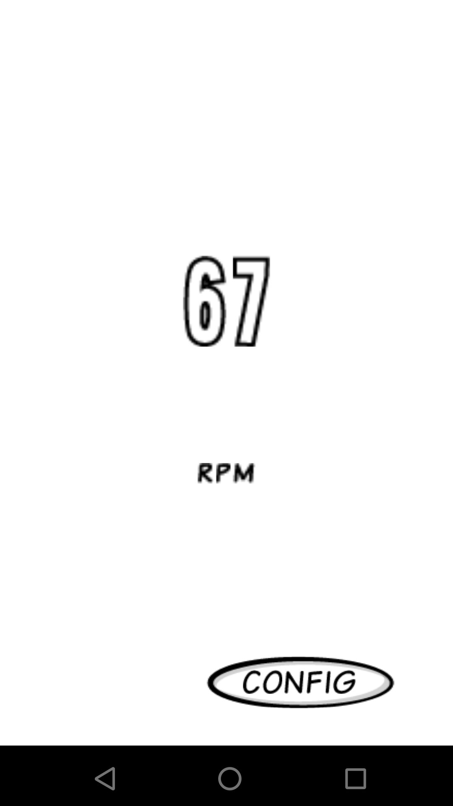

# ble-cadence-app

App with libgdx to test connectivity to Bluetooth low energy (BLE) devices. IOS and Android app working.

It's not the best code and the app needs some refactoring but I needed to know if it was possible to connect to android and ios to bluetooth using libgdx.

It's configured specially for a cadence sensor, but it's not much work to add other ones.

|    |            | 
|----------|:-------------:|
| |   |

## Requirements

- jdk 11
- android studio

## Run

### Desktop

```shell
./gradlew desktop:run
```
### Android

- Emulator (Start an android emulator first)
```shell
./gradlew android:installDebug android:run
```

- Install manually APK
```shell
./gradlew android:packageDebug # Create apk
adb devices # List connected devices
adb -s <device-id> install -r <path-to-apk> # Install apk manually to device
```

### IOS

- Emulator
```shell
./gradlew ios:launchIPhoneSimulator
```

- To install on device use robovm plugin for Android Studio
[Deploying your libGDX game to iOS in 2020](https://medium.com/@bschulte19e/deploying-your-libgdx-game-to-ios-in-2020-4ddce8fff26c)


## References

- Android: https://github.com/Jasonchenlijian/FastBle.git I base the lib on this project.
- For IOS https://github.com/stowersjoshua/iOS-Swift-4-BLE-Example.git (basically translated switf to java)


